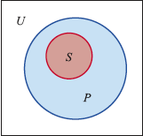

# Chapter 1: Logic

## 1.1 Deductive versus Inductive Reasoning
### Problem Solving
- Logic and reasoning are associated with "problem solving" and "critical thinking"
- First step in solving any problem is to define the problem thoroughly and accurately
  - "What am I being asked to do?"
- After defining the problem, all known/relevant information must be gathered, organized, and analyzed
- Compare present problem to previous ones, how is it similar or different?
- Do not be afraid to try something different
#### Definitions
- `logic`: science of correct reasoning
- `reasoning`: drawing of inferences or conclusions from known or assumed facts

### Deductive Reasoning
- Inductive reasoning is using patterns
- Deductive reasoning is using a specific idea/example/assumption/principle
- Once a problem has been defined and analyzed, it may fall into a known category of problems
- Syllogism is the sequence followed by all logical thought
- This valid pattern of deductive reasoning is known as "modus ponens"
#### Definitions
- `deductive reasoning`: the application of a general statement to a specific instance
- `syllogism`: argument composed of two statements or "premises", followed by a conclusion
- `premises`: statements
- `conclusion`: 
- `valid`: if the premises are inescapable in all instances
- `invalid`: if there is at least one instance where the premises do not follow

### Deductive Reasoning and Venn Diagrams
- Validity of deductive arguments can be shown in Venn diagrams
- To depict statements like `All S are P`, then you can use two circles, one (`S`) inside the other (`P`)
- Inner circle is the "subject category" and the outer circle is the "predicate category"
  - 
- Depicting `No S are P` can be shown by having two disjoint circles in the rectangle
  - 
- Depicting `Some S are P`
  - 
- Depicting `Some S are not P`
  - 
- Important to note that just because an argument is "valid" does not mean it is true
  - It simply means that given the premises, the reasoning to obtain the conclusion is logical
- Similarly, saying that an argument is invalid does not mean the conclusion is false
- Validity is the process of reasoning used to obtain a conclusion
- Truth refers to conformity with fact or experience
#### Definitions
- `venn diagram`: diagram consisting of overlapping figures contained within a rectangle (`U` or universal set)
- `universal affirmative`: a categorical proposition of the type 'All S are P'
- `universal negative`: a categorical proposition of the type 'No S are P'
- `particular affirmative`: a categorical proposition of the type 'Some S are P'
- `particular negative`: a categorical proposition of the type 'Some S are not P'

### Inductive Reasoning
- Inductive arguments are based on extrapolating from specific cases to general cases
- However, the conclusion of an inductive argument is never guaranteed
#### Definitions
- `inductive reasoning`: involves going from series of specific cases to a general statement

## 1.2 Symbolic Logic
### Statements
- All logical reasoning is based on statements
- Symbolic logic uses lowercase letters as labels for statements
#### Definitions
- `statement`: a sentence that is either true or false

### Compound Statements and Logic Connectives
- Compound statements are made up of larger, individual statements
- Can be formed by using connective words such as "and", "or", "if...then...", "only if", "if and only if"
- Compound statement can also be formed by inserting "not" into a simpler statement
- To evaluate compound statements, must examine how statements are connected
- Compound statements can be negation, conjunction, disjunction, conditional, or combination of any of those
#### Definitions
- `compound statement`: statement that contains one or more simpler statements

### The Negation ~p
- Negations are frequently formed by inserting "not" into a statement
  - Ex. `p` = "it is snowing" and `~p` = "it is not snowing"
- A statement and its negation always have opposite truth values, when one is true, the other is false
- Negations are considered compound statements
- Words "all", "some", and "no (none)" are referred to as quantifiers
- Universal affirmative and particular negative are negations of each other
- Universal negative and particular affirmative are negations of each other
#### Definitions
- `negation`: denial of the statement and is represented by the symbol `~`
- `quantifiers`: 

### The Conjunction p ∧  q
